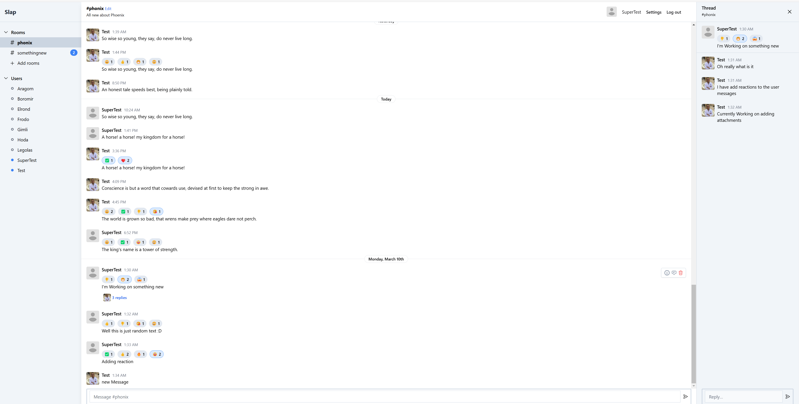

# Slap - A Slack Clone with Phoenix LiveView

Welcome to "Slap," a project designed as a Slack clone to practice Phoenix LiveView 1.0. This README provides instructions on setting up your development environment and gives you information about the application.

## Features

"Slap" includes several features that mimic Slack's functionality:

- **Room Management:** Users can create, edit, and delete their rooms.
- **Browse Rooms:** Users have the ability to browse different rooms and join them.
- **Profile Customization:** Users can upload profile pictures.
- **Real-Time Messaging:** Send and receive messages in real-time with other users.
- **Notifications:** Users get notified of new messages.
- **Message Organization:** Messages are divided by date for easier browsing.
- **Message Management:** Users can delete their own messages.
- **Thread Expansion:** Expand message threads to view more details.
- **Message Reactions:** React to other user's messages.
- **File Sharing:** Upload and share multiple PDFs in messages.
- **Voice Chat:** Real-time voice calls between users with WebRTC.


## ScreenShot




## Getting Started

To set up and run your Phoenix server for this Slack-like application, follow these steps:

### Installation and Setup

1. **Install Dependencies:**

   Run the following command to install necessary dependencies:
   
   ```bash
   mix setup
   ```

2. **Start the Phoenix Server:**

   You can start the Phoenix endpoint using one of the following commands:
   
   - In a terminal, execute:
     ```bash
     mix phx.server
     ```
     
   - To run within IEx (Interactive Elixir), use:
     ```bash
     iex -S mix phx.server
     ```

### Accessing the Application

Once your server is running, you can access the application by navigating to:

- [http://localhost:4000](http://localhost:4000)

in your web browser.

## Production Readiness

When ready to deploy this application in a production environment, refer to our detailed deployment guides available at:

- [Phoenix Deployment Guides](https://hexdocs.pm/phoenix/deployment.html)

### Database Configuration

This application uses PostgreSQL as its database backend. Make sure you have PostgreSQL installed and configured appropriately for both development and production environments.