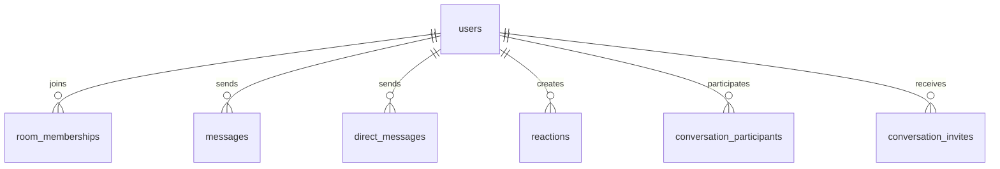
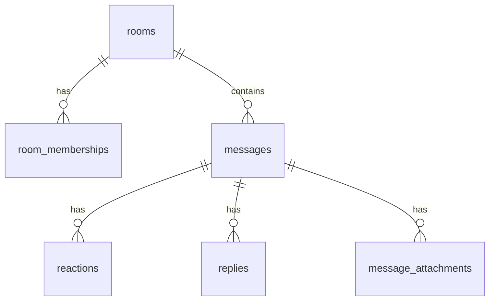
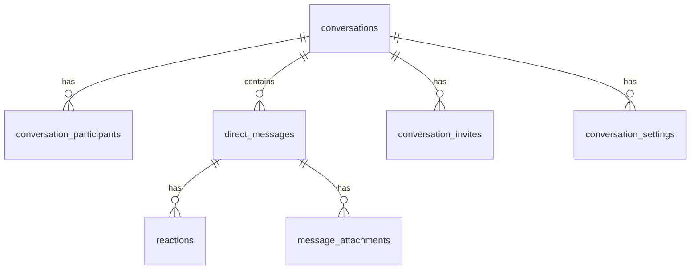

# Schemas

This document provides a comprehensive overview of the Ecto schemas in the Slap application, which define the data structures and validation rules.

## Overview

Schemas in Phoenix define the shape of data, relationships between entities, and validation rules. They provide a clean interface for working with the database and ensure data integrity.

## User Schemas

### Slap.Accounts.User

**Location**: [`lib/slap/accounts/user.ex`](../../lib/slap/accounts/user.ex)

Represents a user account in the system.

#### Fields

```elixir
schema "users" do
  field :email, :string
  field :username, :string
  field :hashed_password, :string
  field :confirmed_at, :utc_datetime
  field :avatar_path, :string
  
  has_many :room_memberships, Chat.RoomMembership
  has_many :rooms, through: [:room_memberships, :room]
  has_many :messages, Chat.Message
  has_many :direct_messages, Chat.DirectMessage
  has_many :reactions, Chat.Reaction
  has_many :conversation_participants, Chat.ConversationParticipant
  has_many :conversations, through: [:conversation_participants, :conversation]
  
  timestamps()
end
```

#### Changesets

```elixir
@doc """
A user changeset for registration.

## Parameters

- `user`: The user struct
- `attrs`: Map of attributes
- `opts`: Options (default: [])

## Validations

- Email: Required, unique, valid format
- Username: Required, unique, 3-20 characters, alphanumeric with underscores
- Password: Required, at least 12 characters, confirmed

"""
def registration_changeset(user, attrs, opts \\ []) do
  user
  |> cast(attrs, [:email, :username, :password])
  |> validate_email()
  |> validate_password()
  |> validate_username()
  |> put_password_hash()
  |> put_change(:confirmed_at, nil)
end

@doc """
A user changeset for updating the email.

## Parameters

- `user`: The user struct
- `attrs`: Map of attributes
- `opts`: Options (default: [])

## Validations

- Email: Required, unique, valid format
- Current password: Required for verification

"""
def email_changeset(user, attrs, opts \\ []) do
  user
  |> cast(attrs, [:email])
  |> validate_email()
  |> case opts do
    [validate_current_password: true] -> 
      user
      |> validate_required([:current_password])
      |> validate_current_password()
    _ -> 
      user
  end
end

@doc """
A user changeset for updating the password.

## Parameters

- `user`: The user struct
- `attrs`: Map of attributes
- `opts`: Options (default: [])

## Validations

- Password: Required, at least 12 characters, confirmed
- Current password: Required for verification

"""
def password_changeset(user, attrs, opts \\ []) do
  user
  |> cast(attrs, [:password])
  |> validate_confirmation(:password, message: "does not match password")
  |> validate_password()
  |> case opts do
    [validate_current_password: true] -> 
      user
      |> validate_required([:current_password])
      |> validate_current_password()
    _ -> 
      user
  end
end
```

#### Validations

```elixir
defp validate_email(changeset) do
  changeset
  |> validate_required([:email])
  |> validate_format(:email, ~r/^[^\s]+@[^\s]+\.[^\s]+$/)
  |> validate_length(:email, max: 160)
  |> unsafe_validate_unique(:email, Slap.Repo)
  |> unique_constraint(:email)
end

defp validate_password(changeset) do
  changeset
  |> validate_required([:password])
  |> validate_length(:password, min: 12, max: 80)
  |> validate_format(:password, ~r/[a-z]/, message: "at least one lower case character")
  |> validate_format(:password, ~r/[A-Z]/, message: "at least one upper case character")
  |> validate_format(:password, ~r/[!?@#$%^&*_0-9]/, message: "at least one digit or special character")
  |> put_pass_hash()
end

defp validate_username(changeset) do
  changeset
  |> validate_required([:username])
  |> validate_length(:username, min: 3, max: 20)
  |> validate_format(:username, ~r/^[a-zA-Z0-9_]+$/, message: "only letters, numbers, and underscores")
  |> unsafe_validate_unique(:username, Slap.Repo)
  |> unique_constraint(:username)
end
```

## Chat Schemas

### Slap.Chat.Room

**Location**: [`lib/slap/chat/room.ex`](../../lib/slap/chat/room.ex)

Represents a chat room where users can exchange messages.

#### Fields

```elixir
schema "rooms" do
  field :name, :string
  field :topic, :string
  
  has_many :room_memberships, Chat.RoomMembership
  has_many :members, through: [:room_memberships, :user]
  has_many :messages, Chat.Message
  
  timestamps()
end
```

#### Changesets

```elixir
@doc """
A room changeset for creation and updates.

## Parameters

- `room`: The room struct
- `attrs`: Map of attributes

## Validations

- Name: Required, unique, 3-50 characters
- Topic: Optional, max 255 characters

"""
def changeset(room, attrs) do
  room
  |> cast(attrs, [:name, :topic])
  |> validate_required([:name])
  |> validate_length(:name, min: 3, max: 50)
  |> validate_length(:topic, max: 255)
  |> unsafe_validate_unique(:name, Slap.Repo)
  |> unique_constraint(:name)
end
```

### Slap.Chat.Message

**Location**: [`lib/slap/chat/message.ex`](../../lib/slap/chat/message.ex)

Represents a message sent in a chat room.

#### Fields

```elixir
schema "messages" do
  field :body, :string
  
  belongs_to :room, Chat.Room
  belongs_to :user, Slap.Accounts.User
  
  has_many :reactions, Chat.Reaction
  has_many :replies, Chat.Reply
  has_many :attachments, Chat.MessageAttachment
  
  timestamps()
end
```

#### Changesets

```elixir
@doc """
A message changeset for creation.

## Parameters

- `message`: The message struct
- `attrs`: Map of attributes

## Validations

- Body: Required, max 2000 characters

"""
def changeset(message, attrs) do
  message
  |> cast(attrs, [:body])
  |> validate_required([:body])
  |> validate_length(:body, min: 1, max: 2000)
  |> trim_body()
end

defp trim_body(changeset) do
  case get_change(changeset, :body) do
    nil -> changeset
    body -> put_change(changeset, :body, String.trim(body))
  end
end
```

### Slap.Chat.RoomMembership

**Location**: [`lib/slap/chat/room_membership.ex`](../../lib/slap/chat/room_membership.ex)

Represents a user's membership in a chat room.

#### Fields

```elixir
schema "room_memberships" do
  field :last_read_id, :integer
  
  belongs_to :room, Chat.Room
  belongs_to :user, Slap.Accounts.User
  
  timestamps()
end
```

#### Changesets

```elixir
@doc """
A room membership changeset for creation and updates.

## Parameters

- `membership`: The room membership struct
- `attrs`: Map of attributes

## Validations

- Room: Required
- User: Required
- Last read ID: Optional, must be positive integer

"""
def changeset(room_membership, attrs) do
  room_membership
  |> cast(attrs, [:last_read_id])
  |> validate_number(:last_read_id, greater_than: 0)
  |> assoc_constraint(:room)
  |> assoc_constraint(:user)
  |> unique_constraint([:room_id, :user_id])
end
```

### Slap.Chat.Reaction

**Location**: [`lib/slap/chat/reaction.ex`](../../lib/slap/chat/reaction.ex)

Represents an emoji reaction to a message or direct message.

#### Fields

```elixir
schema "reactions" do
  field :emoji, :string
  
  belongs_to :message, Chat.Message
  belongs_to :direct_message, Chat.DirectMessage
  belongs_to :user, Slap.Accounts.User
  
  timestamps()
end
```

#### Changesets

```elixir
@doc """
A reaction changeset for creation.

## Parameters

- `reaction`: The reaction struct
- `attrs`: Map of attributes

## Validations

- Emoji: Required, must be a valid emoji
- User: Required
- Either message or direct message: Required (mutually exclusive)

"""
def changeset(reaction, attrs) do
  reaction
  |> cast(attrs, [:emoji])
  |> validate_required([:emoji])
  |> validate_length(:emoji, max: 10)
  |> assoc_constraint(:message)
  |> assoc_constraint(:direct_message)
  |> assoc_constraint(:user)
  |> check_constraint(:message_or_direct_message)
end
```

### Slap.Chat.Reply

**Location**: [`lib/slap/chat/reply.ex`](../../lib/slap/chat/reply.ex)

Represents a reply to a message (thread).

#### Fields

```elixir
schema "replies" do
  field :body, :string
  
  belongs_to :message, Chat.Message
  belongs_to :user, Slap.Accounts.User
  
  timestamps()
end
```

#### Changesets

```elixir
@doc """
A reply changeset for creation.

## Parameters

- `reply`: The reply struct
- `attrs`: Map of attributes

## Validations

- Body: Required, max 2000 characters
- Message: Required
- User: Required

"""
def changeset(reply, attrs) do
  reply
  |> cast(attrs, [:body])
  |> validate_required([:body])
  |> validate_length(:body, min: 1, max: 2000)
  |> assoc_constraint(:message)
  |> assoc_constraint(:user)
end
```

### Slap.Chat.MessageAttachment

**Location**: [`lib/slap/chat/message_attachment.ex`](../../lib/slap/chat/message_attachment.ex)

Represents a file attachment for a message or direct message.

#### Fields

```elixir
schema "message_attachments" do
  field :filename, :string
  field :path, :string
  field :content_type, :string
  field :size, :integer
  
  belongs_to :message, Chat.Message
  belongs_to :direct_message, Chat.DirectMessage
  
  timestamps()
end
```

#### Changesets

```elixir
@doc """
A message attachment changeset for creation.

## Parameters

- `attachment`: The message attachment struct
- `attrs`: Map of attributes

## Validations

- Filename: Required, max 255 characters
- Path: Required, max 500 characters
- Content type: Required, max 100 characters
- Size: Required, must be positive
- Either message or direct message: Required (mutually exclusive)

"""
def changeset(message_attachment, attrs) do
  message_attachment
  |> cast(attrs, [:filename, :path, :content_type, :size])
  |> validate_required([:filename, :path, :content_type, :size])
  |> validate_length(:filename, max: 255)
  |> validate_length(:path, max: 500)
  |> validate_length(:content_type, max: 100)
  |> validate_number(:size, greater_than: 0)
  |> assoc_constraint(:message)
  |> assoc_constraint(:direct_message)
  |> check_constraint(:message_or_direct_message)
end
```

## Direct Messaging Schemas

### Slap.Chat.Conversation

**Location**: [`lib/slap/chat/conversation.ex`](../../lib/slap/chat/conversation.ex)

Represents a direct message conversation (one-on-one or group).

#### Fields

```elixir
schema "conversations" do
  field :title, :string
  field :last_message_at, :utc_datetime
  field :participant_count, :integer, default: 0
  
  has_many :conversation_participants, Chat.ConversationParticipant
  has_many :participants, through: [:conversation_participants, :user]
  has_many :direct_messages, Chat.DirectMessage
  has_many :conversation_settings, Chat.ConversationSetting
  has_many :conversation_invites, Chat.ConversationInvite
  
  timestamps(type: :utc_datetime)
end
```

#### Changesets

```elixir
@doc """
A conversation changeset for creation and updates.

## Parameters

- `conversation`: The conversation struct
- `attrs`: Map of attributes

## Validations

- Title: Optional, max 255 characters
- Participant count: Required, must be non-negative

"""
def changeset(conversation, attrs) do
  conversation
  |> cast(attrs, [:title, :last_message_at, :participant_count])
  |> validate_length(:title, max: 255)
  |> validate_number(:participant_count, greater_than_or_equal_to: 0)
end
```

### Slap.Chat.DirectMessage

**Location**: [`lib/slap/chat/direct_message.ex`](../../lib/slap/chat/direct_message.ex)

Represents a direct message sent in a conversation.

#### Fields

```elixir
schema "direct_messages" do
  field :body, :string
  
  belongs_to :conversation, Chat.Conversation
  belongs_to :user, Slap.Accounts.User
  
  has_many :reactions, Chat.Reaction
  has_many :attachments, Chat.MessageAttachment
  
  timestamps(type: :utc_datetime)
end
```

#### Changesets

```elixir
@doc """
A direct message changeset for creation.

## Parameters

- `direct_message`: The direct message struct
- `attrs`: Map of attributes

## Validations

- Body: Required, max 2000 characters
- Conversation: Required
- User: Required

"""
def changeset(direct_message, attrs) do
  direct_message
  |> cast(attrs, [:body])
  |> validate_required([:body])
  |> validate_length(:body, min: 1, max: 2000)
  |> assoc_constraint(:conversation)
  |> assoc_constraint(:user)
end
```

### Slap.Chat.ConversationParticipant

**Location**: [`lib/slap/chat/conversation_participant.ex`](../../lib/slap/chat/conversation_participant.ex)

Represents a user's participation in a conversation.

#### Fields

```elixir
schema "conversation_participants" do
  field :last_read_at, :utc_datetime
  field :role, :string, default: "member"
  
  belongs_to :conversation, Chat.Conversation
  belongs_to :user, Slap.Accounts.User
  
  timestamps(type: :utc_datetime)
end
```

#### Changesets

```elixir
@doc """
A conversation participant changeset for creation and updates.

## Parameters

- `participant`: The conversation participant struct
- `attrs`: Map of attributes

## Validations

- Role: Required, must be one of: member, moderator, admin
- Conversation: Required
- User: Required

"""
def changeset(conversation_participant, attrs) do
  conversation_participant
  |> cast(attrs, [:last_read_at, :role])
  |> validate_inclusion(:role, ["member", "moderator", "admin"])
  |> validate_required([:role])
  |> assoc_constraint(:conversation)
  |> assoc_constraint(:user)
  |> unique_constraint([:conversation_id, :user_id])
end
```

### Slap.Chat.ConversationInvite

**Location**: [`lib/slap/chat/conversation_invite.ex`](../../lib/slap/chat/conversation_invite.ex)

Represents an invitation for a user to join a conversation.

#### Fields

```elixir
schema "conversation_invites" do
  field :token, :string
  field :status, :string, default: "pending"
  
  belongs_to :conversation, Chat.Conversation
  belongs_to :inviter, Slap.Accounts.User
  belongs_to :invitee, Slap.Accounts.User
  
  timestamps(type: :utc_datetime)
end
```

#### Changesets

```elixir
@doc """
A conversation invite changeset for creation.

## Parameters

- `invite`: The conversation invite struct
- `attrs`: Map of attributes

## Validations

- Token: Required, unique
- Status: Required, must be one of: pending, accepted, declined
- Conversation: Required
- Inviter: Required
- Invitee: Required

"""
def changeset(conversation_invite, attrs) do
  conversation_invite
  |> cast(attrs, [:token, :status])
  |> validate_required([:token, :status])
  |> validate_inclusion(:status, ["pending", "accepted", "declined"])
  |> assoc_constraint(:conversation)
  |> assoc_constraint(:inviter)
  |> assoc_constraint(:invitee)
  |> unique_constraint(:token)
end
```

### Slap.Chat.ConversationSetting

**Location**: [`lib/slap/chat/conversation_setting.ex`](../../lib/slap/chat/conversation_setting.ex)

Represents settings for a conversation.

#### Fields

```elixir
schema "conversation_settings" do
  field :is_public, :boolean, default: false
  field :allow_invites, :boolean, default: true
  
  belongs_to :conversation, Chat.Conversation
  
  timestamps(type: :utc_datetime)
end
```

#### Changesets

```elixir
@doc """
A conversation setting changeset for creation and updates.

## Parameters

- `setting`: The conversation setting struct
- `attrs`: Map of attributes

## Validations

- Conversation: Required (unique)

"""
def changeset(conversation_setting, attrs) do
  conversation_setting
  |> cast(attrs, [:is_public, :allow_invites])
  |> validate_required([:is_public, :allow_invites])
  |> assoc_constraint(:conversation)
  |> unique_constraint(:conversation_id)
end
```

## Schema Relationships

### User Relationships



### Chat Room Relationships



### Direct Message Relationships



## Schema Best Practices

### Validation

- Use built-in validations when possible
- Create custom validations for business rules
- Validate at the database level with constraints
- Provide clear error messages

### Associations

- Define associations clearly
- Use appropriate association types
- Set up foreign key constraints
- Consider performance implications

### Changesets

- Create specific changesets for different operations
- Use pattern matching for different scenarios
- Handle errors gracefully
- Document validation rules

### Security

- Never expose sensitive fields
- Use proper authorization
- Validate all inputs
- Sanitize outputs

This schema documentation provides a comprehensive overview of the data structures in the Slap application, making it easier for developers to understand the data model and relationships.