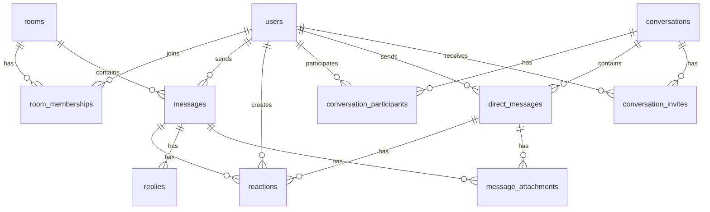

# Database Schema

This document provides a comprehensive overview of the Slap application's database schema, including tables, relationships, and design considerations.

## Schema Overview

The database is designed to support real-time chat functionality with efficient querying for common operations. The schema follows these principles:

- **Normalization**: Properly normalized to avoid data redundancy
- **Performance**: Optimized indexes for common query patterns
- **Scalability**: Designed to handle growing amounts of data
- **Integrity**: Foreign key constraints maintain data consistency

## Table Relationships



## Core Tables

### Users Table

Stores user account information and authentication data.

```sql
CREATE TABLE users (
  id SERIAL PRIMARY KEY,
  email VARCHAR(255) NOT NULL UNIQUE,
  username VARCHAR(255) NOT NULL UNIQUE,
  hashed_password VARCHAR(255) NOT NULL,
  confirmed_at TIMESTAMP WITH TIME ZONE,
  avatar_path VARCHAR(255),
  inserted_at TIMESTAMP WITH TIME ZONE NOT NULL DEFAULT NOW(),
  updated_at TIMESTAMP WITH TIME ZONE NOT NULL DEFAULT NOW()
);
```

**Indexes:**
- `users_email_index` (unique) on `email`
- `users_username_index` (unique) on `username`

**Schema Module:** [`Slap.Accounts.User`](../lib/slap/accounts/user.ex)

### Rooms Table

Stores chat room information.

```sql
CREATE TABLE rooms (
  id SERIAL PRIMARY KEY,
  name VARCHAR(255) NOT NULL UNIQUE,
  topic VARCHAR(255),
  inserted_at TIMESTAMP WITH TIME ZONE NOT NULL DEFAULT NOW(),
  updated_at TIMESTAMP WITH TIME ZONE NOT NULL DEFAULT NOW()
);
```

**Indexes:**
- `rooms_name_index` (unique) on `name`

**Schema Module:** [`Slap.Chat.Room`](../lib/slap/chat/room.ex)

### Room Memberships Table

Tracks which users are members of which rooms and their read status.

```sql
CREATE TABLE room_memberships (
  id SERIAL PRIMARY KEY,
  room_id INTEGER NOT NULL REFERENCES rooms(id) ON DELETE CASCADE,
  user_id INTEGER NOT NULL REFERENCES users(id) ON DELETE CASCADE,
  last_read_id INTEGER,
  inserted_at TIMESTAMP WITH TIME ZONE NOT NULL DEFAULT NOW(),
  updated_at TIMESTAMP WITH TIME ZONE NOT NULL DEFAULT NOW(),
  UNIQUE(room_id, user_id)
);
```

**Indexes:**
- `room_memberships_room_id_index` on `room_id`
- `room_memberships_user_id_index` on `user_id`
- `room_memberships_room_id_user_id_index` (unique) on `room_id`, `user_id`

**Schema Module:** [`Slap.Chat.RoomMembership`](../lib/slap/chat/room_membership.ex)

### Messages Table

Stores all chat room messages.

```sql
CREATE TABLE messages (
  id SERIAL PRIMARY KEY,
  body TEXT NOT NULL,
  room_id INTEGER NOT NULL REFERENCES rooms(id) ON DELETE CASCADE,
  user_id INTEGER NOT NULL REFERENCES users(id) ON DELETE CASCADE,
  inserted_at TIMESTAMP WITH TIME ZONE NOT NULL DEFAULT NOW(),
  updated_at TIMESTAMP WITH TIME ZONE NOT NULL DEFAULT NOW()
);
```

**Indexes:**
- `messages_room_id_index` on `room_id`
- `messages_user_id_index` on `user_id`
- `messages_inserted_at_index` on `inserted_at`
- `messages_search_index` (GIN) on `to_tsvector('english', body)`

**Schema Module:** [`Slap.Chat.Message`](../lib/slap/chat/message.ex)

## Direct Messaging Tables

### Conversations Table

Stores direct message conversations (both one-on-one and group).

```sql
CREATE TABLE conversations (
  id SERIAL PRIMARY KEY,
  title VARCHAR(255),
  last_message_at TIMESTAMP WITH TIME ZONE,
  participant_count INTEGER NOT NULL DEFAULT 0,
  inserted_at TIMESTAMP WITH TIME ZONE NOT NULL DEFAULT NOW(),
  updated_at TIMESTAMP WITH TIME ZONE NOT NULL DEFAULT NOW()
);
```

**Indexes:**
- `conversations_last_message_at_index` on `last_message_at`
- `conversations_participant_count_index` on `participant_count`

**Schema Module:** [`Slap.Chat.Conversation`](../lib/slap/chat/conversation.ex)

### Conversation Participants Table

Tracks which users participate in which conversations.

```sql
CREATE TABLE conversation_participants (
  id SERIAL PRIMARY KEY,
  conversation_id INTEGER NOT NULL REFERENCES conversations(id) ON DELETE CASCADE,
  user_id INTEGER NOT NULL REFERENCES users(id) ON DELETE CASCADE,
  last_read_at TIMESTAMP WITH TIME ZONE,
  role VARCHAR(255) NOT NULL DEFAULT 'member',
  inserted_at TIMESTAMP WITH TIME ZONE NOT NULL DEFAULT NOW(),
  updated_at TIMESTAMP WITH TIME ZONE NOT NULL DEFAULT NOW(),
  UNIQUE(conversation_id, user_id)
);
```

**Indexes:**
- `conversation_participants_conversation_id_index` on `conversation_id`
- `conversation_participants_user_id_index` on `user_id`
- `conversation_participants_conversation_id_user_id_index` (unique) on `conversation_id`, `user_id`

**Schema Module:** [`Slap.Chat.ConversationParticipant`](../lib/slap/chat/conversation_participant.ex)

### Direct Messages Table

Stores direct messages within conversations.

```sql
CREATE TABLE direct_messages (
  id SERIAL PRIMARY KEY,
  body TEXT NOT NULL,
  conversation_id INTEGER NOT NULL REFERENCES conversations(id) ON DELETE CASCADE,
  user_id INTEGER NOT NULL REFERENCES users(id) ON DELETE CASCADE,
  inserted_at TIMESTAMP WITH TIME ZONE NOT NULL DEFAULT NOW(),
  updated_at TIMESTAMP WITH TIME ZONE NOT NULL DEFAULT NOW()
);
```

**Indexes:**
- `direct_messages_conversation_id_index` on `conversation_id`
- `direct_messages_user_id_index` on `user_id`
- `direct_messages_inserted_at_index` on `inserted_at`
- `direct_messages_search_index` (GIN) on `to_tsvector('english', body)`

**Schema Module:** [`Slap.Chat.DirectMessage`](../lib/slap/chat/direct_message.ex)

## Supporting Tables

### Replies Table

Stores thread replies to messages.

```sql
CREATE TABLE replies (
  id SERIAL PRIMARY KEY,
  body TEXT NOT NULL,
  message_id INTEGER NOT NULL REFERENCES messages(id) ON DELETE CASCADE,
  user_id INTEGER NOT NULL REFERENCES users(id) ON DELETE CASCADE,
  inserted_at TIMESTAMP WITH TIME ZONE NOT NULL DEFAULT NOW(),
  updated_at TIMESTAMP WITH TIME ZONE NOT NULL DEFAULT NOW()
);
```

**Indexes:**
- `replies_message_id_index` on `message_id`
- `replies_user_id_index` on `user_id`

**Schema Module:** [`Slap.Chat.Reply`](../lib/slap/chat/reply.ex)

### Reactions Table

Stores emoji reactions to messages and direct messages.

```sql
CREATE TABLE reactions (
  id SERIAL PRIMARY KEY,
  emoji VARCHAR(255) NOT NULL,
  message_id INTEGER REFERENCES messages(id) ON DELETE CASCADE,
  direct_message_id INTEGER REFERENCES direct_messages(id) ON DELETE CASCADE,
  user_id INTEGER NOT NULL REFERENCES users(id) ON DELETE CASCADE,
  inserted_at TIMESTAMP WITH TIME ZONE NOT NULL DEFAULT NOW(),
  updated_at TIMESTAMP WITH TIME ZONE NOT NULL DEFAULT NOW(),
  CHECK (
    (message_id IS NOT NULL AND direct_message_id IS NULL) OR
    (message_id IS NULL AND direct_message_id IS NOT NULL)
  )
);
```

**Indexes:**
- `reactions_message_id_index` on `message_id`
- `reactions_direct_message_id_index` on `direct_message_id`
- `reactions_user_id_index` on `user_id`

**Schema Module:** [`Slap.Chat.Reaction`](../lib/slap/chat/reaction.ex)

### Message Attachments Table

Stores file attachments for messages and direct messages.

```sql
CREATE TABLE message_attachments (
  id SERIAL PRIMARY KEY,
  filename VARCHAR(255) NOT NULL,
  path VARCHAR(255) NOT NULL,
  content_type VARCHAR(255),
  size INTEGER,
  message_id INTEGER REFERENCES messages(id) ON DELETE CASCADE,
  direct_message_id INTEGER REFERENCES direct_messages(id) ON DELETE CASCADE,
  inserted_at TIMESTAMP WITH TIME ZONE NOT NULL DEFAULT NOW(),
  updated_at TIMESTAMP WITH TIME ZONE NOT NULL DEFAULT NOW(),
  CHECK (
    (message_id IS NOT NULL AND direct_message_id IS NULL) OR
    (message_id IS NULL AND direct_message_id IS NOT NULL)
  )
);
```

**Indexes:**
- `message_attachments_message_id_index` on `message_id`
- `message_attachments_direct_message_id_index` on `direct_message_id`

**Schema Module:** [`Slap.Chat.MessageAttachment`](../lib/slap/chat/message_attachment.ex)

### Conversation Invites Table

Stores invitations for users to join group conversations.

```sql
CREATE TABLE conversation_invites (
  id SERIAL PRIMARY KEY,
  conversation_id INTEGER NOT NULL REFERENCES conversations(id) ON DELETE CASCADE,
  inviter_id INTEGER NOT NULL REFERENCES users(id) ON DELETE CASCADE,
  invitee_id INTEGER NOT NULL REFERENCES users(id) ON DELETE CASCADE,
  token VARCHAR(255) NOT NULL UNIQUE,
  status VARCHAR(255) NOT NULL DEFAULT 'pending',
  inserted_at TIMESTAMP WITH TIME ZONE NOT NULL DEFAULT NOW(),
  updated_at TIMESTAMP WITH TIME ZONE NOT NULL DEFAULT NOW()
);
```

**Indexes:**
- `conversation_invites_conversation_id_index` on `conversation_id`
- `conversation_invites_inviter_id_index` on `inviter_id`
- `conversation_invites_invitee_id_index` on `invitee_id`
- `conversation_invites_token_index` (unique) on `token`

**Schema Module:** [`Slap.Chat.ConversationInvite`](../lib/slap/chat/conversation_invite.ex)

### Conversation Settings Table

Stores settings for conversations.

```sql
CREATE TABLE conversation_settings (
  id SERIAL PRIMARY KEY,
  conversation_id INTEGER NOT NULL UNIQUE REFERENCES conversations(id) ON DELETE CASCADE,
  is_public BOOLEAN NOT NULL DEFAULT false,
  allow_invites BOOLEAN NOT NULL DEFAULT true,
  inserted_at TIMESTAMP WITH TIME ZONE NOT NULL DEFAULT NOW(),
  updated_at TIMESTAMP WITH TIME ZONE NOT NULL DEFAULT NOW()
);
```

**Indexes:**
- `conversation_settings_conversation_id_index` (unique) on `conversation_id`

**Schema Module:** [`Slap.Chat.ConversationSetting`](../lib/slap/chat/conversation_setting.ex)

## Performance Indexes

Additional indexes have been added to optimize common queries:

### Direct Messaging Performance Indexes

```sql
-- Optimized for fetching user conversations with unread counts
CREATE INDEX idx_conversation_participants_user_id_last_read_at 
ON conversation_participants(user_id, last_read_at);

-- Optimized for counting unread messages
CREATE INDEX idx_direct_messages_conversation_id_inserted_at 
ON direct_messages(conversation_id, inserted_at);

-- Optimized for active conversations
CREATE INDEX idx_conversations_last_message_at_participant_count 
ON conversations(last_message_at DESC NULLS LAST, participant_count);

-- Optimized for conversation lookups between users
CREATE INDEX idx_conversation_participants_user_id_conversation_id 
ON conversation_participants(user_id, conversation_id);
```

## Migrations

All database changes are managed through Ecto migrations in the `priv/repo/migrations/` directory.

### Key Migrations

1. **Initial Schema** (`20250120124421_create_rooms.exs`): Creates basic room structure
2. **User Authentication** (`20250123085013_create_users_auth_tables.exs`): Adds user tables
3. **Messages** (`20250123090319_create_messages.exs`): Adds messaging functionality
4. **Direct Messaging** (`20250830184700_create_direct_messaging_tables.exs`): Adds direct messaging
5. **Performance Optimizations** (`20250904220536_add_direct_messaging_performance_indexes.exs`): Adds performance indexes

### Running Migrations

```bash
# Run all pending migrations
mix ecto.migrate

# Rollback the last migration
mix ecto.rollback

# Create a new migration
mix ecto.gen.migration description_of_change
```

## Database Design Considerations

### Timestamps

All tables use `TIMESTAMP WITH TIME ZONE` for consistent timezone handling across deployments.

### Soft Deletes

The application uses hard deletes for most data. Consider soft deletes for audit trails if needed.

### Full-Text Search

PostgreSQL's built-in full-text search is used for message searching with `to_tsvector` and `to_tsquery`.

### Cascade Deletes

Foreign key constraints use `ON DELETE CASCADE` to maintain data integrity when parent records are deleted.

### Unique Constraints

Unique constraints prevent duplicate data and ensure data integrity.

## Query Patterns

### Common Queries

1. **Get User's Rooms with Unread Counts**
   ```sql
   SELECT r.*, COUNT(m.id) - COALESCE(rm.last_read_id, 0) as unread_count
   FROM rooms r
   JOIN room_memberships rm ON r.id = rm.room_id
   LEFT JOIN messages m ON r.id = m.room_id
   WHERE rm.user_id = $1
   GROUP BY r.id, rm.last_read_id
   ORDER BY r.name;
   ```

2. **Get User's Direct Message Conversations**
   ```sql
   SELECT c.*, COUNT(dm.id) - COALESCE(cp.last_read_at, '1970-01-01') as unread_count
   FROM conversations c
   JOIN conversation_participants cp ON c.id = cp.conversation_id
   LEFT JOIN direct_messages dm ON c.id = dm.conversation_id
   WHERE cp.user_id = $1
   GROUP BY c.id, cp.last_read_at
   ORDER BY c.last_message_at DESC NULLS LAST;
   ```

3. **Search Messages**
   ```sql
   SELECT m.*, u.username, u.avatar_path
   FROM messages m
   JOIN users u ON m.user_id = u.id
   WHERE m.room_id = $1
     AND to_tsvector('english', m.body) @@ to_tsquery('english', $2)
   ORDER BY m.inserted_at DESC
   LIMIT $3 OFFSET $4;
   ```

## Database Maintenance

### Vacuum and Analyze

Regular maintenance is important for performance:

```sql
VACUUM ANALYZE;
```

### Monitoring

Monitor slow queries and database performance using:
- PostgreSQL logs
- Phoenix LiveDashboard
- External monitoring tools

### Backup Strategy

Implement regular backups:
```bash
pg_dump slap_prod > backup_$(date +%Y%m%d_%H%M%S).sql
```

This database schema provides a solid foundation for the chat application while maintaining performance and data integrity.